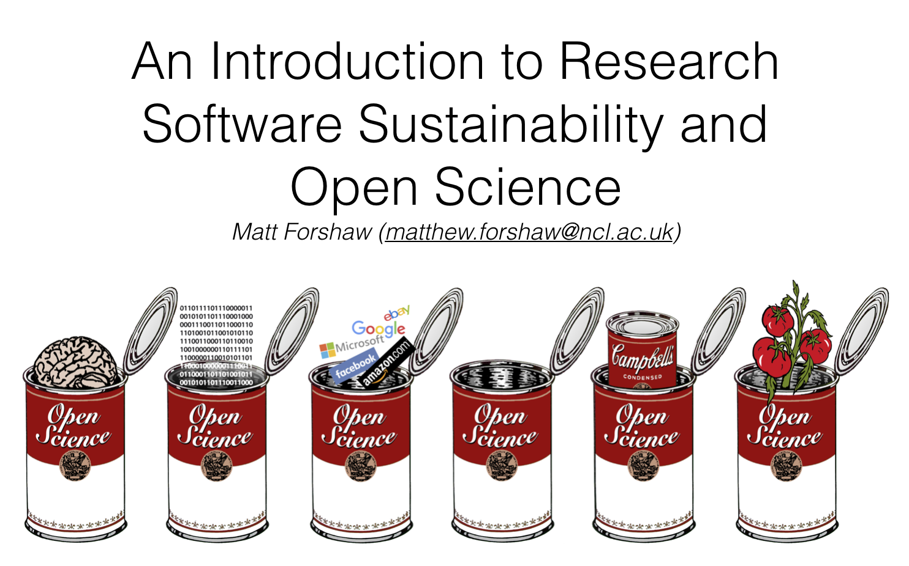

# An Introduction to Research Software Sustainability and Open Science

Slide deck as <a href="https://github.com/mattforshaw/NewcastleResearchSoftwareSustainability/blob/master/nclrssos_110719.pdf">PDF</a>.

## Abstract
We know that modern scientific research isn’t possible without software, from short, thrown-together temporary scripts and the abundance of complex spreadsheets, through to the huge software enterprises. But how much of it do we understand from a professional services viewpoint? And where does software fit in the growing requirement to share research outputs?

This talk will explore the role software plays in supporting world-leading research, and as itself a first-class research output. We will introduce the principles of reproducible research and open science, and explore how we can support the research software development process to maximise the impact and long-term sustainability of research. This non-technical talk is ideally suited to teams who support research, e.g. in preparing grant applications, providing technical support for researchers, and those capturing research impact.

## Links to resources
- <a href="https://carpentries.org/">Carpentries</a> - free training resources in version control, command-line scripting and other topics relating to reproducible research.

- <a href="https://the-turing-way.netlify.com/introduction/introduction">The Turing Way</a> - A handbook for reproducible data science

## Acknowledgements 
Many thanks to <a href="https://www.ncl.ac.uk/library/contact/staff/profile/chris.emmerson">Chris Emmerson</a> from the <a href="https://research.ncl.ac.uk/rdm/">Research Data Service (RDS)</a> for the invitation and various discussions on this topic.
